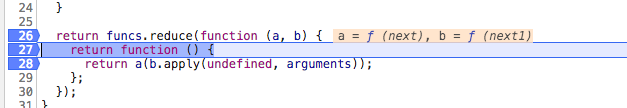
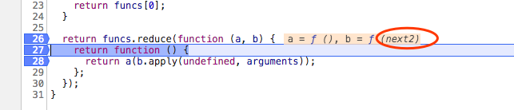

# redux 最核心的 就是中间件

```js
// 我自定义三个中间件，用于后续源码分析
const logger = ({ getState }) => {
    return next => {
        return action => {
            console.log('dispatching1', action)
            const result = next(action)
            console.log('next state1', getState())
            return result
        }
    }
}

const logger1 = ({ getState }) => {
    return next1 => {
        return action1 => {
			console.log('dispatching1', action1)
			const result = next1(action1)
			console.log('next state1', getState())
			return result
		}
	}
}
const logger2 = ({ getState }) => {
	return next2 => {
		return action2 => {
			console.log('dispatching2', action2)
			const result = next2(action2)
			console.log('next state2', getState())
			return result
		}
	}
}

// 创建store
const store = createStore(
	reducer,
	applyMiddleware(logger, logger1, logger2)
)

```
## createStore

如果传入了enhancer，createStore会传递给enhancer包装一次，其实就是增强dispatch，重新包装了dispatch

```js
if (typeof enhancer !== 'undefined') {
	if (typeof enhancer !== 'function') {
		throw new Error('Expected the enhancer to be a function.')
	}
	// 把createStore 传给enhancer 在调用一次返回的函数
	// enhancer是 applyMiddleware 函数生成的函数
	// 每个middleware 里面的dispatch和getState 会被再次包装
	return enhancer(createStore)(reducer, preloadedState)
}
```

## applyMiddleware分析

```js
export default function applyMiddleware(...middlewares) {
	// 在createStore里面 enhancer(createStore)(reducer, preloadedState)
	//...args = (reducer, preloadedState)
	return createStore => (...args) => {
		// 调用createStore
		// 此时会调用dispatch({type:init})
		const store = createStore(...args)

		let dispatch = () => {
			throw new Error(
				`Dispatching while constructing your middleware is not allowed. ` +
				`Other middleware would not be applied to this dispatch.`
			)
		}

		const middlewareAPI = {
			getState: store.getState,
			dispatch: (...args) => dispatch(...args)
		}

		// 所有middlewares 调用一次传递进去getState和dispatch，中间件里面能拿到getState和dispatch
		const chain = middlewares.map(middleware => middleware(middlewareAPI))

		// dispatch = f1(f2(f3(store.dispatch))))，一层包一层，这是洋葱模型，直到抛到最根上的store.dispatch
		// next(action) 最终会调用到store.dispatch(action)
		dispatch = compose(...chain)(store.dispatch)
		// 返回一个包装后的 dispatch
		return {
			...store,
			dispatch
		}
	}
}
```

> 在applyMiddleware 里面dispatch被重新包装，赋予了新的能力，redux整个核心和难点就在这里，

> const chain = middlewares.map(middleware => middleware(middlewareAPI))，第一次调用中间件，让中间件里面能拿到getState和dispatch,chain也是保存中间件的一个数组。

```js
// 这句话进行拆解
dispatch = compose(...chain)(store.dispatch)
// 拆解为两句话，逐步分析
const func = compose(...chain)

dispatch = func(store.dispatch)
```

### func = compose(...chain)

```js
// 对compose 函数里面这句代码也进行重新格式化
return funcs.reduce((a, b) => (...args) => a(b(...args)))
// 格式化为以下代码，
return funcs.reduce(function (a, b) {
	return function () {
		return a(b.apply(undefined, arguments));
	};
});
```

自定义的三个中间件进行创建store,然后打上断点对代码进行调试观察compose最核心这句代码的运行情况

1、 第一次运行发现a是next b是next1



2、 继续下一步，发现a已经上上一次运行返回的函数，b是next2



3、 我们可以把以上过程用代码表示出来

```js
var a1 = function () {
	return next(next1.apply(undefined, arguments));
};

var a2 = function () {
	// arguments --dispatch
	return a1(next2.apply(undefined, arguments))
};
// 最返回的是a2
// 回到上面提到的func = compose(...chain)
// func = a2
```

** 得到 func = compose(...chain) = a2 **

### dispatch = func(store.dispatch) --> a2(store.dispatch)

> 观察上面拆解的代码，a2(store.dispatch)
1、首先会执行next2.apply(undefined, [store.dispatch])

2、然后next2内部拿到next就是store.dispatch，把next2.apply(undefined, [store.dispatch])执行完成的结果有传递给a1

3、a1(next2(disapath))

4、next(next1.apply(undefined, next2))

5、这个时候执行 next1.apply(undefined, arguments),arguments是next2的返回结果，其实就是logger2的这个函数

```js
 action2 => {
	console.log('dispatching2', action2)
	const result = next2(action2)
	console.log('next state2', getState())
	return result
}
```

6、next1执行完毕内部拿到的next的是next2，这个时候把next1 执行完成返回的函数传递给next

7、next(next1)，执行next;next在内部拿到的next的是next1,最后返回next的action函数

8、 三个中间件执行完毕，最终返回的是第一个的action,代码如下

```js
// 第一个logger的action
 return action => {
            console.log('dispatching1', action)
            const result = next(action)
            console.log('next state1', getState())
            return result
        }
```

9、 dispatch = a2(store.dispatch) = 第一个logger的action

> 总结： 最终返回的是第一个logger的action，赋值给dispatch。这个新的dispatch执行的时候，会调用logger的action函数；logger内部action函数执行，拿到的next是logger1的action函数；logger1的action执行，调用next拿到的是next2的action；logger2的action执行，内部调用next，拿到的next是原始的store.dispatch。
